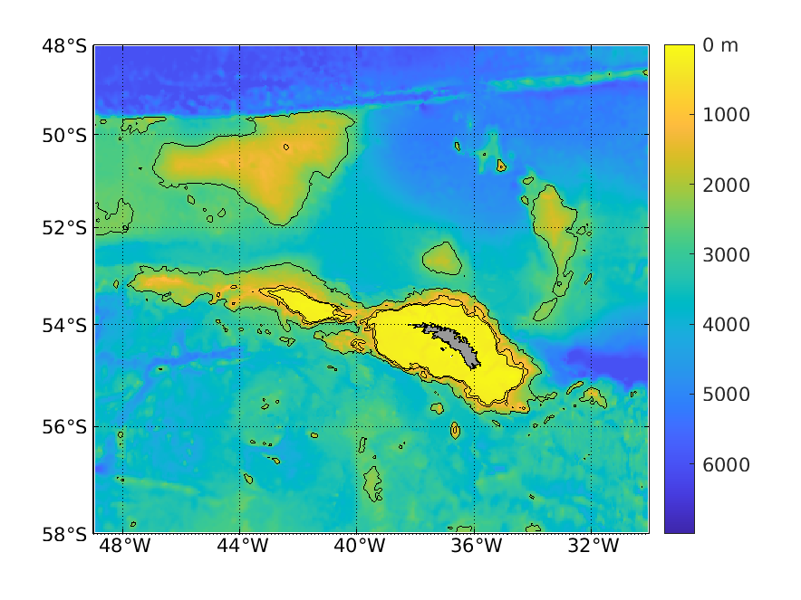

- - - -
# South Georgia Oceanographic Model
NEMO regional configuration for South Georgia
- - - -

## Introduction
A regional oceanographic model for the South Georgia region has been developed to undertake analyses on the spatial and temporal variability in the regional oceanography, the key drivers of this variability, and the impact on the distribution of exploited species. The model development was funded by the UK Foreign, Commonwealth and Development Office. The underlying model system is NEMO (Nucleus for European Modelling of the Ocean; <https://www.nemo-ocean.eu/>), which has been widely adopted by the European scientific community for a range of modelling studies from regional to global scales. NEMO is a highly versatile modelling system, and includes a range of options for model parameterisation that enables good representation of regions characterised by complex bathymetry and precipitous shelf-edges.

## Model Overview

The South Georgia regional model extends from 58°S, 49°W to 48°S, 30°W, with bathymetry derived from GEBCO2014 and a high-resolution dataset for the South Georgia shelf compiled by Hogg et al. (Figure 1). The model has a horizontal resolution of 1/20° longitude by 1/40° latitude (~2.5 - 3km, varying with latitude). The vertical dimension is represented by 75 levels arranged as partial-cell z-levels, and with variable cell depth such that vertical resolution is enhanced over the shallow shelf regions. The models are forced at the open boundaries with tides from a global tidal model (TPXO7.2), and with barotropic flows, sea surface height, temperature and salinity from a global application of NEMO at 1/12° horizontal resolution. Atmospheric forcing is derived from reanalysis (DFS5.2). Climatological spatially-varying terrestrial freshwater input is included using a theoretical description of the seasonal melt cycle based on historical temperature and precipitation data. The model has been run for 1992-2012 with simulated sea surface height, mixed layer depth, 3D temperature, salinity and velocities saved as 5-day mean fields.

#### Figure 1: Model bathymetry; black contours are at 500, 1000 and 2500 m.

## Installation instructions

The South Georgia regional model was developed using NEMOv3.6 and XIOS2.0, and was run on the ARCHER high performance computer. The following instructions are specific to that combination of software and hardware.
* First, install the appropriate versions of NEMO and XIOS on ARCHER in your home directory. NEMOv3.6 is available to download from https://forge.ipsl.jussieu.fr/nemo . To obtain XIOS2.0, use the following command: 
svn co http://forge.ipsl.jussieu.fr/ioserver/svn/XIOS/branchs/xios-2.0
* Next, load netCDF and HDF5 libraries as well as Intel compilers. On ARCHER, the commands are:
  * module load cray-netcdf-hdf5parallel
  * module load cray-hdf5-parallel
  * module swap PrgEnv-cray PrgEnv-intel
* Put the file containing the compiler settings for NEMO (arch-XC_ARCHER_INTEL.fcm in directory ARCH) in the directory NEMOGCM/ARCH/.
* Put the files containing the compiler settings for XIOS (arch-XC30_ARCHER.fcm, arch-XC30_ARCHER.path and arch-XC30_ARCHER.env in directory ARCH) in the directory XIOS/ARCH/.
* Install XIOS by running the following command in the XIOS folder:
  * ./make_xios --prod --full --arch XC30_ARCHER
* Copy the whole XIOS directory to your work area, and edit the NEMO ‘arch’ file so the correct path to the XIOS directory in your work area is specified for %XIOS_HOME.
* Copy the XIOS executable (xios_server.exe) from the XIOS bin directory to NEMOGCM/CONFIG/GYRE_XIOS/EXP00
* Navigate to the directory NEMOGCM/CONFIG and create a baseline model configuration from the reference GYRE_XIOS case as follows:
  * ./makenemo -n SG -m XC_ARCHER_INTEL -r GYRE_XIOS
* Replace file cpp_SG.fcm in directory SG with the version provided here (in directory CPP).
* Put configuration-specific versions of source code provided here (in directory MY_SRC) into directory SG/MY_SRC.
* Put the following configuration-specific files (in directory EXP00) in the SG/EXP00 directory:
  * bathy_meter.nc
  * coordinates.nc
  * coordinates.bdy.nc
  * namelist_cfg
  * weights_dfs5.2_SGnemo_bilin.nc
* Create directory DATA in the SG/EXP00 directory for external forcing data (open boundary forcing, atmospheric forcing, terrestrial freshwater inputs).
* Download the DRAKKAR Forcing Set (DFS) atmospheric reanalysis data for 1990 listed in the namelist_cfg file to the SG/EXP00/DATA directory; if you are not able to access this through DRAKKAR, please contact Emma Young (eyoung@bas.ac.uk).
* Open boundary and terrestrial freshwater forcing are available on the BAS external ftp site (ftp://ftp.bas.ac.uk) in directory eyoung/SG/DATA. Your login should be username=anonymous with your full email address as password. Put downloaded forcing files in directory SG/EXP00/DATA.
* Files containing example initial conditions (SGnemo_init_T_030190_06.nc and SGnemo_init_S_030190_06.nc) are also available on the BAS external ftp site (see above) in directory eyoung/SG/INIT. These should be placed in the SG/EXP00 directory.
* Navigate to NEMOGCM/CONFIG/SG/EXP00. Create a runscript or adapt the example files provided (runnemo.sh.1990 and run.SG.pbs.1990 in directory EXP00).
* Navigate to NEMOGCM/CONFIG, clean the configuration, and recompile as follows:
  * ./makenemo -n SG clean
  * ./makenemo -n SG -m XC_ARCHER_INTEL
* Run the model:
  * qsub run.SG.pbs.1990
